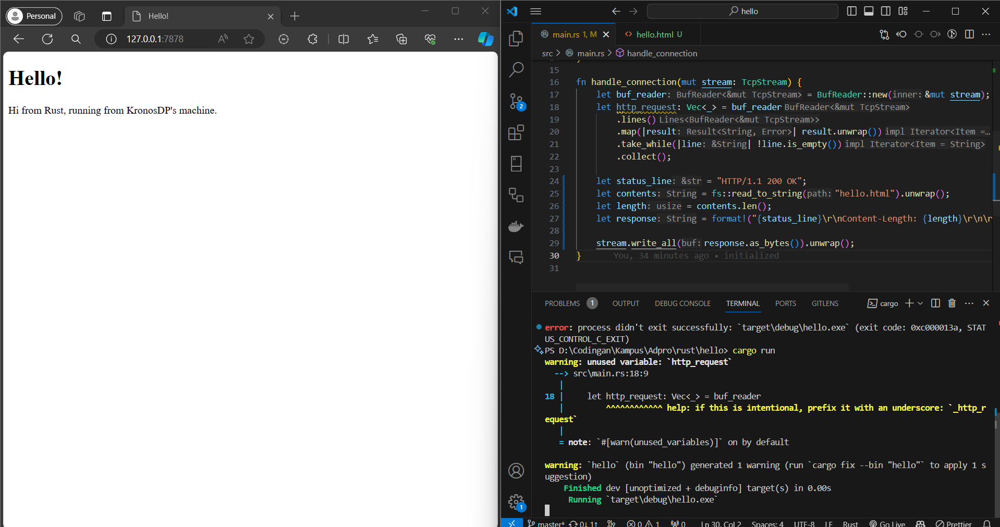
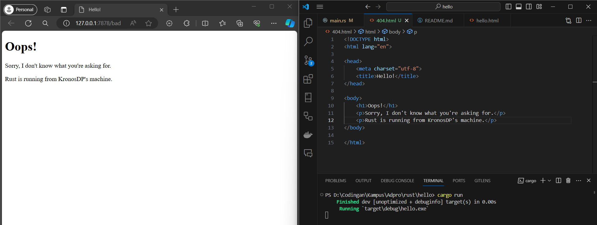

## Refleksi 1

handle*connection adalah sebuah fungsi yang mengambil `TcpStream` sebagai argumen yang adalah mutable. Secara keseluruhan dia digunakan untuk mengurus \_client* yang masuk kedalam koneksi.

Pertama kita membuat `BufReader`. Hal ini sesuai namanya digunakan untuk menambahkan buffering pada tugas-tugas _read_. Hal ini untuk memperbaiki isu performa.

Lines berguna untuk memisahkan setiap data yang memiliki new line. Kemudian kita menggunakan map untuk melakukan unwrap sebagai string. Take while kemudian akan berjalan selagi line nya tidak kosong. Terakhir pada collect, semuanya akan dikumpulkan dan dalam kasus ini hasilnya akan digabungkan menjadi vektor.

Terakhir, hasilnya akan di print denan println.

## Refleksi 2

Ingat bahwa kode status 200 berarti semuanya sudah baik dijalankan. Selanjutnya contents adalah untuk membaca file yang ada yang dalam kasus ini adalah hello.html yang kemudian akan kita ubah menjadi string. Kemudian pada length akan kita dapatkan panjang stringnya. Kemudian responsenya adalah string formatting dimana Context Length adalah panjang file hello.html.

## Refleksi 3

Perhatikan bahwa pada dasarnya kita sedang melakukan pengecekan request line. Disini kita ingin melakukan apakah situs yang kita ingin kunjungi benar atau tidak. Jika request line nya benar `"GET / HTTP/1.1\r\n"`, maka itu sudah sesuai ekspektasi kita. Hal itu akan membuat kita mengeset variabel status line dan file yang ingin kita tuju, dalam kasus ini hello.html atau 404.html.

## Refleksi 4

Ketika saya pertama kali mencari /sleep, yang akan dilakukan adalah thread akan sleep selama 10 detik. Kemudian, thread ini akan berjalan kembali dengan normal. Jika kita memasukkan url yang biasa ke dalam ke dalam mesin pencari, yang akan terjadi adalah sleep masih akan tetap dijalankan dan kita tetap menunggu /sleep untuk selesai dijalankan.

Perhatikan hal penting bahwa disini saya mengubah buf_reader dan request line menjadi tidak mutable. Hal inilah yang kemudian membuat kode "menunggu" ini perlu bekerja.

## Refleksi 5

Perhatikan bahwa threadpool sebenarnya mirip seperti sebuah queue. Sebenarnya implementasi dalamnya pada kasus ini menggunakan Vector, tapi idenya sebenarnya sama. Kemudian tugas-tugas yang berada di vektor ini akan dibagikan ke pada thread yang ada. Setiap thread akan kemudian mengeksekusi tugas yang ada. Hal inilah yang pada dasarnya dilakukan oleh ThreadPool dan Worker.

Hal menarik yang saya dapati adalah pemahaman tentang sifat undeterministik dari program ini. Kita tidak bisa melakukan prediksi thread mana yang akan digunakan. Pada awalnya saya mengira thread yang akan digunakan adalah sesuai dengan urutanya, yaitu 0, 1, 2, dan 3 secara berurutan. Tetapi hal demikian tidak saya amati. Walaupun demikian, siklus yang saya amati adalah jika saya melakukan reload halaman yang sama, tanpa terlalu banyak hal lain yang dilakukan, bentuknnya adalah siklis. Dalam percobaan saya tersebut saya mendapat 0, 2, 1, 3 mendapatkan job dan thread tersebut akan loop kembali jika dilakukan reload.
